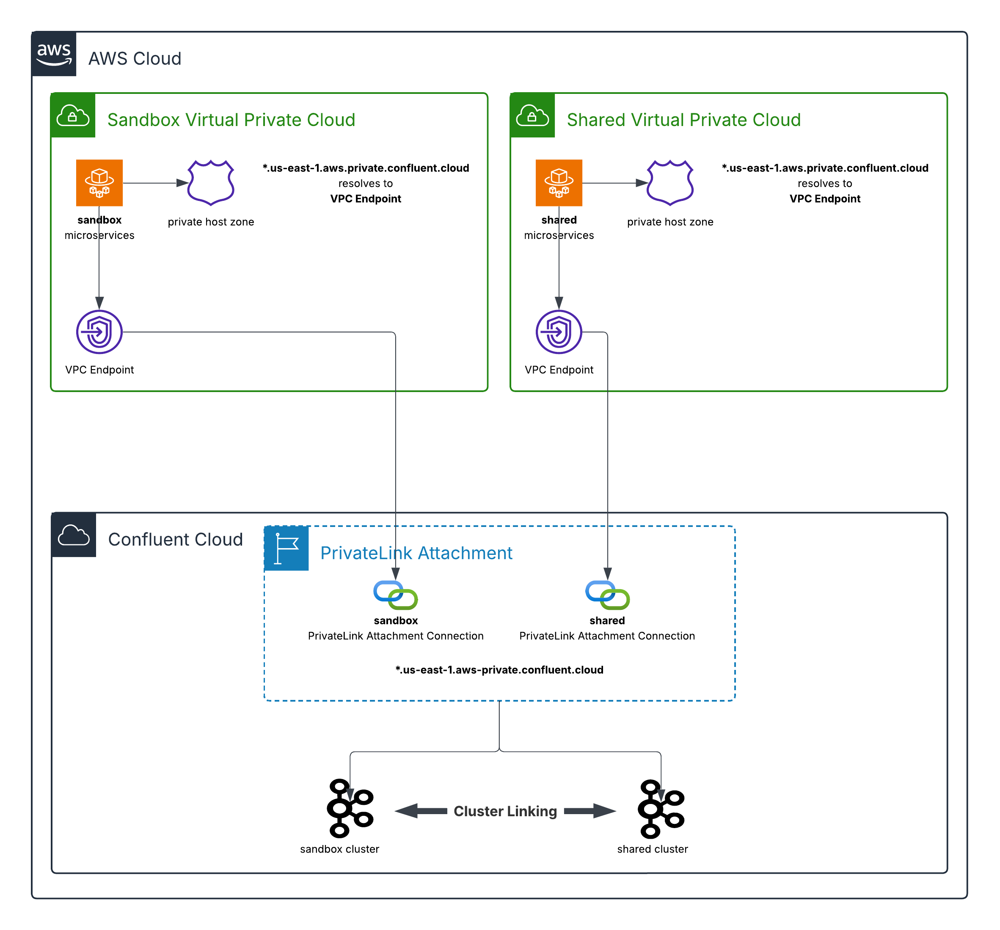

# Confluent Cloud IaC AWS Private Network Interface (PNI) with Two Isolated VPCs with Cluster Linking between them Example
This repository provides **production-grade Terraform infrastructure-as-code** that implements a **secure, multi-network Confluent Cloud architecture**. It demonstrates **AWS PrivateLink connectivity from a single Confluent Cloud environment to multiple AWS VPCs**, enabling private, network-isolated access without exposing traffic to the public internet.

The solution also showcases **in-region Cluster Linking between two Confluent Cloud Kafka clusters**, enabling **low-latency, fully managed data replication** across teams, lines of business, or isolated environments (for example, development, staging, and production) within the same AWS region.

Cluster Linking maintains an **in-sync mirror of selected topics** on the consuming cluster. This isolation allows consuming teams to independently scale **large numbers of consumers, stream processing applications, and downstream sinks** without impacting the producing cluster. From the producer’s perspective, the load is equivalent to **a single additional consumer**, regardless of downstream scale.

Access control and ownership remain cleanly separated: the producing team grants **scoped read credentials** to approved topics, while the consuming team **creates, owns, monitors, and manages the cluster link**. This pattern enables secure, scalable data sharing with clear operational boundaries and minimal coupling.



Below is the Terraform resource visualization of the infrastructure that's created:


**Table of Contents**
<!-- toc -->
+ [**1.0 Resources**](#10-resources)
    - [**1.1 Terminology**](#11-terminology)
    - [**1.2 Related Documentation**](#12-related-documentation)
<!-- tocstop -->


## **1.0 Resources**

### **1.1 Terminology**
- **PHZ**: Private Hosted Zone - AWS Route 53 Private Hosted Zone is a DNS service that allows you to create and manage private DNS zones within your VPCs.
- **TFC**: Terraform Cloud - A service that provides infrastructure automation using Terraform.
- **VPC**: Virtual Private Cloud - A virtual network dedicated to your AWS account.
- **AWS**: Amazon Web Services - A comprehensive cloud computing platform provided by Amazon.
- **CC**: Confluent Cloud - A fully managed event streaming platform based on Apache Kafka.
- **PL**: PrivateLink - An AWS service that enables private connectivity between VPCs and services.
- **IaC**: Infrastructure as Code - The practice of managing and provisioning computing infrastructure through machine-readable definition files.

### **1.2 Related Documentation**
- [AWS PrivateLink Overview in Confluent Cloud](https://docs.confluent.io/cloud/current/networking/aws-privatelink-overview.html#aws-privatelink-overview-in-ccloud)
- [Use AWS PrivateLink for Serverless Products on Confluent Cloud](https://docs.confluent.io/cloud/current/networking/aws-platt.html#use-aws-privatelink-for-serverless-products-on-ccloud)
- [GitHub Sample Project for Confluent Terraform Provider PrivateLink Attachment](https://github.com/confluentinc/terraform-provider-confluent/tree/master/examples/configurations/enterprise-privatelinkattachment-aws-kafka-acls)
- [Geo-replication with Cluster Linking on Confluent Cloud](https://docs.confluent.io/cloud/current/multi-cloud/cluster-linking/index.html#geo-replication-with-cluster-linking-on-ccloud)
- [Use the Confluent Cloud Console with Private Networking](https://docs.confluent.io/cloud/current/networking/ccloud-console-access.html?ajs_aid=9a5807f8-b35a-447c-a414-b31dd39ae98a&ajs_uid=2984609)


This command can be used to verify that the appropriate routes have been added to the Terraform Cloud Agent VPC route tables:
```bash
(echo -e "RouteTableId\tDestination\tGateway\tTransitGateway\tState"; \
aws ec2 describe-route-tables \
  --filters "Name=vpc-id,Values=<TFC_AGENT_VPC_ID>" \
  --output json | jq -r '.RouteTables[] | . as $rt | .Routes[] | 
  [$rt.RouteTableId, .DestinationCidrBlock, .GatewayId, .TransitGatewayId, .State] | @tsv') | \
  column -t -s $'\t'
```