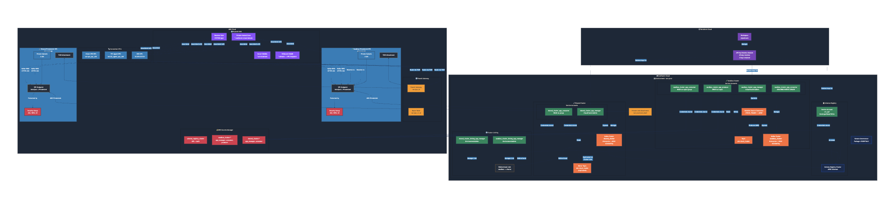
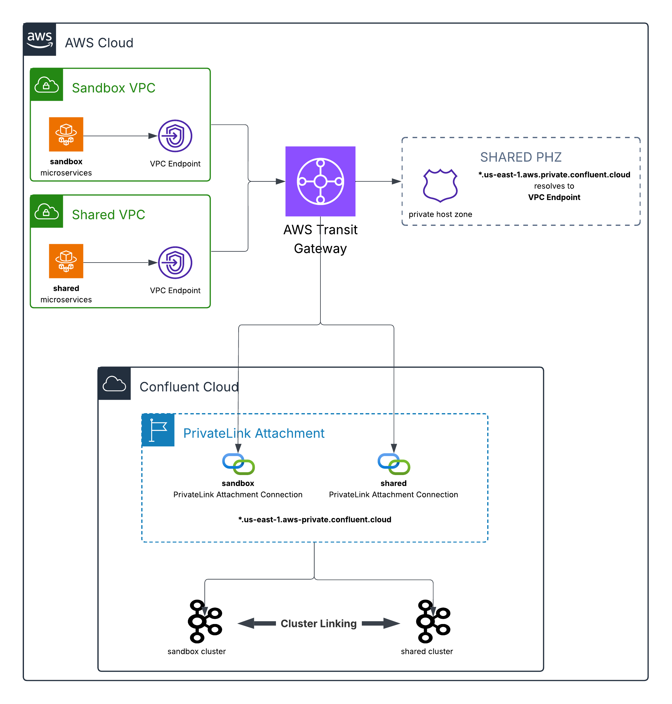
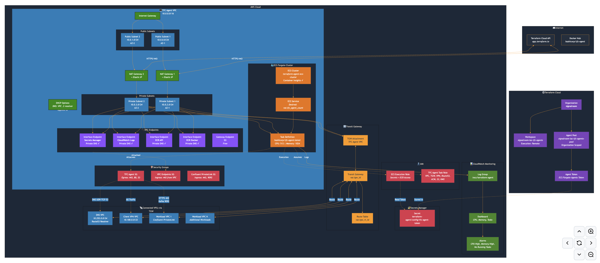
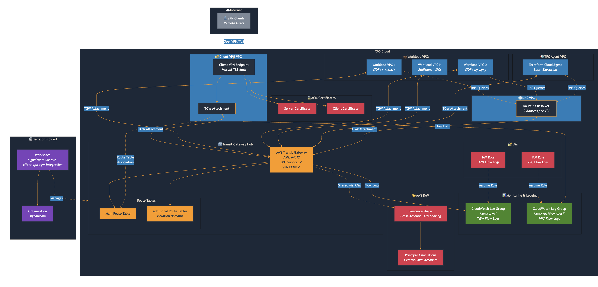

# IaC Confluent Cloud AWS Private Linking with Cluster Linking Example



This repository provides **production-grade Terraform infrastructure-as-code** that implements a **secure, multi-network Confluent Cloud architecture**. It demonstrates **AWS PrivateLink connectivity from a single Confluent Cloud environment to multiple AWS VPCs**, enabling private, network-isolated access without exposing traffic to the public internet.

The solution also showcases **in-region Cluster Linking between two Confluent Cloud Kafka clusters**, enabling **low-latency, fully managed data replication** across teams, lines of business, or isolated environments (for example, development, staging, and production) within the same AWS region.

Cluster Linking maintains an **in-sync mirror of selected topics** on the consuming cluster. This isolation allows consuming teams to independently scale **large numbers of consumers, stream processing applications, and downstream sinks** without impacting the producing cluster. From the producer’s perspective, the load is equivalent to **a single additional consumer**, regardless of downstream scale.



Access control and ownership remain cleanly separated: the producing team grants **scoped read credentials** to approved topics, while the consuming team **creates, owns, monitors, and manages the cluster link**. This pattern enables secure, scalable data sharing with clear operational boundaries and minimal coupling.

Below is the Terraform resource visualization of the infrastructure that's created:


**Table of Contents**
<!-- toc -->
+ [**1.0 Prerequisites**](#10-prerequisites)
    - [**1.1 Client VPN, Centralized DNS Server, and Transit Gateway**](#11-client-vpn-centralized-dns-server-and-transit-gateway)
    - [**1.2 Terraform Cloud Agent**](#12-terraform-cloud-agent)
+ [**2.0 Project's Architecture Overview**](#20-projects-architecture-overview)
+ [**3.0 Let's Get Started**](#30-lets-get-started)
    - [**3.1 Deploying the Infrastructure**](#31-deploying-the-infrastructure)
    - [**3.2 Destroying the Infrastructure**](#32-destroying-the-infrastructure)
+ [**4.0 Resources**](#40-resources)
    - [**4.1 Terminology**](#41-terminology)
    - [**4.2 Related Documentation**](#42-related-documentation)
<!-- tocstop -->

## **1.0 Prerequisites**
This project assumes you have the following prerequisites in place:
- Client VPN, Centralized DNS Server, and Transit Gateway
- Terraform Cloud Agent

### **1.1 Client VPN, Centralized DNS Server, and Transit Gateway**


The diagram illustrates:

**Core Components:**
- **Transit Gateway Hub** — Central connectivity point with ASN 64512, DNS support, and VPN ECMP enabled. Includes main and additional route tables for traffic isolation
- **Client VPN VPC** — Hosts the VPN endpoint with mutual TLS authentication using ACM server/client certificates, with TGW attachment for routing

**Connected VPCs:**
- **Workload VPCs** — Multiple VPCs with distinct CIDR ranges connected via TGW attachments
- **TFC Agent VPC** — Dedicated VPC for Terraform Cloud agents (local execution mode)
- **DNS VPC** — Centralized Route 53 resolver for cross-VPC DNS resolution

**Supporting Services:**
- **AWS RAM** — Cross-account sharing of the Transit Gateway to external AWS accounts
- **CloudWatch** — Flow logs for both TGW and VPC traffic with dedicated IAM roles
- **Terraform Cloud** — signalRoom organization managing the infrastructure via the `signalroom-iac-aws-client-vpn-tgw-integration` workspace

**Traffic Flow:**
1. Remote VPN clients connect via OpenVPN/TLS to the Client VPN endpoint
2. Traffic routes through the TGW to reach workload VPCs, TFC agents, or DNS services
3. VPN client traffic routes back through the TGW via the dedicated route table association

### **1.2 Terraform Cloud Agent**


The diagram illustrates:

**Terraform Cloud Integration:**
- **signalroom** organization with remote execution workspace
- **Agent Pool** (organization-scoped) with token stored in AWS Secrets Manager
- Agents poll Terraform Cloud API via NAT Gateway

**TFC Agent VPC (10.0.0.0/16):**
- **Public Subnets** — Host NAT Gateways with Elastic IPs for outbound internet
- **Private Subnets** — Run ECS Fargate tasks (no public IPs)
- **DHCP Options** — Configure DNS to use VPC's .2 resolver

**ECS Fargate Cluster:**
- Runs `hashicorp/tfc-agent:latest` containers (512 CPU / 1024 MB)
- Container Insights enabled for monitoring
- Circuit breaker with auto-rollback on deployment failures

**VPC Endpoints (PrivateLink):**
- **Secrets Manager** — Retrieve TFC agent token privately
- **CloudWatch Logs** — Stream logs without NAT
- **ECR API + Docker** — Pull container images privately
- **S3 Gateway** — Free endpoint for ECR layer storage

**Transit Gateway Connectivity:**
- Routes to **DNS VPC** (10.255.0.0/24) for Confluent domain resolution
- Routes to **Client VPN VPC** (10.100.0.0/22) for admin access
- Routes to **Workload VPCs** for Confluent PrivateLink (ports 443, 9092)

**Security Groups:**
- **TFC Agent SG** — Outbound HTTPS/HTTP/DNS to internet + specific VPC routes
- **VPC Endpoints SG** — Inbound 443 from VPC CIDR
- **Confluent PrivateLink SG** — Inbound 443/9092 from agents

## **2.0 Project's Architecture Overview**
**Confluent Cloud Environment (non-prod):**

| Component | Details |
|-----------|---------|
| **Sandbox Cluster** | Enterprise tier, HIGH availability, hosts `dev-stock_trades` topic |
| **Shared Cluster** | Enterprise tier, HIGH availability, receives mirrored data |
| **Cluster Linking** | Bidirectional link replicates `dev-stock_trades` between clusters |
| **DataGen Connector** | Produces STOCK_TRADES data in AVRO format |
| **Schema Registry** | Stream Governance ESSENTIALS package for schema management |
| **PrivateLink Attachment** | Single attachment exposes both clusters to AWS |

**Service Accounts & RBAC:**
- **Cluster Managers** — CloudClusterAdmin role for each cluster
- **Producers/Consumers** — Topic-specific ACLs (READ/WRITE/DESCRIBE)
- **Connector SA** — DESCRIBE cluster, WRITE/CREATE topics
- **Cluster Linking SAs** — EnvironmentAdmin for link management
- **Schema Registry SA** — DeveloperRead/Write on all subjects

**AWS PrivateLink VPCs:**
- **Sandbox VPC** (10.0.0.0/20) — 3 AZ private subnets with VPC Endpoint
- **Shared VPC** (10.1.0.0/20) — 3 AZ private subnets with VPC Endpoint
- Both attached to Transit Gateway with route propagation

**DNS Architecture:**
- **Private Hosted Zone** — Centralized PHZ for Confluent domain
- **Wildcard + Zonal CNAMEs** — Route to VPC Endpoint DNS entries
- **SYSTEM Resolver Rule** — Associated with all 5 VPCs (DNS, VPN, TFC Agent, Sandbox, Shared)

**Security & Secrets:**
- **Security Groups** — Allow ports 443 (HTTPS), 9092 (Kafka), 53 (DNS) from TFC Agent and VPN CIDRs
- **Secrets Manager** — Stores JAAS configs and bootstrap servers for all service accounts
- **API Key Rotation** — 30-day rotation with 2 keys retained per service account

**Connectivity Flow:**
1. VPN/TFC Agent clients resolve `*.<AWS_REGION>.aws.private.confluent.cloud` via PHZ
2. DNS returns VPC Endpoint private IPs
3. Traffic routes through Transit Gateway to appropriate PrivateLink VPC
4. VPC Endpoint forwards to Confluent Cloud via AWS PrivateLink

## **3.0 Let's Get Started**

### **3.1 Deploying the Infrastructure**

### **3.2 Destroying the Infrastructure**

```bash
╷
│ Error: error deleting Kafka ACLs "lkc-j6wj9w/TOPIC#sandbox_aws_privatelink_example_#LITERAL#User:sa-w7xo5n9#*#CREATE#ALLOW": Delete "https://lkc-j6wj9w.us-east-1.aws.private.confluent.cloud:443/kafka/v3/clusters/lkc-j6wj9w/acls?host=%2A&operation=CREATE&pattern_type=LITERAL&permission=ALLOW&principal=User%3Asa-w7xo5n9&resource_name=sandbox_aws_privatelink_example_&resource_type=TOPIC": dial tcp: lookup lkc-j6wj9w.us-east-1.aws.private.confluent.cloud on 10.2.0.2:53: no such host
│ 
│ 
╵
╷
│ Error: error deleting Kafka ACLs "lkc-j6wj9w/TOPIC#sandbox_aws_privatelink_example_#LITERAL#User:sa-w7xo5n9#*#WRITE#ALLOW": Delete "https://lkc-j6wj9w.us-east-1.aws.private.confluent.cloud:443/kafka/v3/clusters/lkc-j6wj9w/acls?host=%2A&operation=WRITE&pattern_type=LITERAL&permission=ALLOW&principal=User%3Asa-w7xo5n9&resource_name=sandbox_aws_privatelink_example_&resource_type=TOPIC": dial tcp: lookup lkc-j6wj9w.us-east-1.aws.private.confluent.cloud on 10.2.0.2:53: no such host
│ 
│ 
╵
╷
│ Error: error deleting Kafka ACLs "lkc-j6wj9w/CLUSTER#kafka-cluster#LITERAL#User:sa-w7xo5n9#*#DESCRIBE#ALLOW": Delete "https://lkc-j6wj9w.us-east-1.aws.private.confluent.cloud:443/kafka/v3/clusters/lkc-j6wj9w/acls?host=%2A&operation=DESCRIBE&pattern_type=LITERAL&permission=ALLOW&principal=User%3Asa-w7xo5n9&resource_name=kafka-cluster&resource_type=CLUSTER": dial tcp: lookup lkc-j6wj9w.us-east-1.aws.private.confluent.cloud on 10.2.0.2:53: no such host
│ 
│ 
╵
╷
│ Error: error waiting for Kafka Mirror Topic "lkc-99gmp5/bidirectional-between-sandbox-and-shared/dev-stock_trades" to be deleted: Get "https://lkc-99gmp5.us-east-1.aws.private.confluent.cloud:443/kafka/v3/clusters/lkc-99gmp5/links/bidirectional-between-sandbox-and-shared/mirrors/dev-stock_trades": dial tcp: lookup lkc-99gmp5.us-east-1.aws.private.confluent.cloud on 10.2.0.2:53: no such host; could not parse error details; raw response body: ""
│ 
│ 
╵
╷
│ Error: error deleting Kafka ACLs "lkc-j6wj9w/TOPIC#dev-stock_trades#LITERAL#User:sa-w7xo5n9#*#WRITE#ALLOW": Delete "https://lkc-j6wj9w.us-east-1.aws.private.confluent.cloud:443/kafka/v3/clusters/lkc-j6wj9w/acls?host=%2A&operation=WRITE&pattern_type=LITERAL&permission=ALLOW&principal=User%3Asa-w7xo5n9&resource_name=dev-stock_trades&resource_type=TOPIC": dial tcp: lookup lkc-j6wj9w.us-east-1.aws.private.confluent.cloud on 10.2.0.2:53: no such host
│ 
│ 
╵
Operation failed: failed running terraform apply (exit 1)
```

If you encounter DNS resolution errors during the destroy process, do the following:

**Navigate to the Terraform directory:**
```bash
cd terraform
```

***Remove the unreachable resources from the Terraform state:**
```bash
terraform state rm 'confluent_kafka_acl.sandbox_cluster_app_connector_describe_on_cluster'
terraform state rm 'confluent_kafka_acl.sandbox_cluster_app_connector_write_on_target_topic'
terraform state rm 'confluent_kafka_acl.sandbox_cluster_app_connector_create_on_data_preview_topics'
terraform state rm 'confluent_kafka_acl.sandbox_cluster_app_connector_write_on_data_preview_topics'
terraform state rm 'confluent_cluster_link.sandbox_and_shared'
terraform state rm 'confluent_cluster_link.shared_to_sandbox'
terraform state rm 'confluent_kafka_topic.source_stock_trades'
terraform state rm 'confluent_kafka_mirror_topic.stock_trades_mirror'
```

**Navigate back to the root directory:**
```bash
cd ..
```

**Rerun the destroy command:**
```bash
```

## **4.0 Resources**

### **4.1 Terminology**
- **PHZ**: Private Hosted Zone - AWS Route 53 Private Hosted Zone is a DNS service that allows you to create and manage private DNS zones within your VPCs.
- **TFC**: Terraform Cloud - A service that provides infrastructure automation using Terraform.
- **VPC**: Virtual Private Cloud - A virtual network dedicated to your AWS account.
- **AWS**: Amazon Web Services - A comprehensive cloud computing platform provided by Amazon.
- **CC**: Confluent Cloud - A fully managed event streaming platform based on Apache Kafka.
- **PL**: PrivateLink - An AWS service that enables private connectivity between VPCs and services.
- **IaC**: Infrastructure as Code - The practice of managing and provisioning computing infrastructure through machine-readable definition files.

### **4.2 Related Documentation**
- [AWS PrivateLink Overview in Confluent Cloud](https://docs.confluent.io/cloud/current/networking/aws-privatelink-overview.html#aws-privatelink-overview-in-ccloud)
- [Use AWS PrivateLink for Serverless Products on Confluent Cloud](https://docs.confluent.io/cloud/current/networking/aws-platt.html#use-aws-privatelink-for-serverless-products-on-ccloud)
- [GitHub Sample Project for Confluent Terraform Provider PrivateLink Attachment](https://github.com/confluentinc/terraform-provider-confluent/tree/master/examples/configurations/enterprise-privatelinkattachment-aws-kafka-acls)
- [Geo-replication with Cluster Linking on Confluent Cloud](https://docs.confluent.io/cloud/current/multi-cloud/cluster-linking/index.html#geo-replication-with-cluster-linking-on-ccloud)
- [Use the Confluent Cloud Console with Private Networking](https://docs.confluent.io/cloud/current/networking/ccloud-console-access.html?ajs_aid=9a5807f8-b35a-447c-a414-b31dd39ae98a&ajs_uid=2984609)
- [IP Filtering on Confluent Cloud](https://docs.confluent.io/cloud/current/security/access-control/ip-filtering/overview.html?ajs_aid=9a5807f8-b35a-447c-a414-b31dd39ae98a&ajs_uid=2984609#ip-filtering-overview)
- [AWS/Azure PrivateLink Networking Course](https://developer.confluent.io/courses/confluent-cloud-networking/private-link/)
- [Hands On: Configuring a PrivateLink Cluster](https://developer.confluent.io/courses/confluent-cloud-networking/configure-private-link/)
