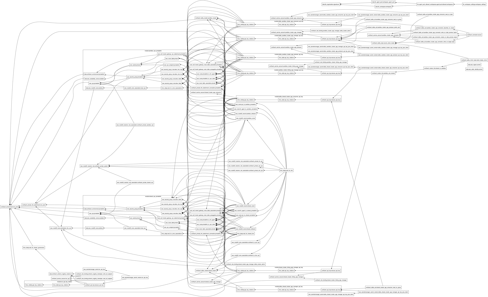

# Confluent Cloud Infrastructure as Code (IaC) Cluster Linking with PrivateLink Demo
This repository contains Terraform code to set up Confluent Cloud infrastructure with a focus on Cluster Linking using PrivateLink for secure connectivity.

Below is the Terraform visualization of the infrastructure that's created:

**Table of Contents**
<!-- toc -->
+ [**1.0 Resources**](#10-resources)
<!-- tocstop -->

## **1.0 Resources**
- [AWS PrivateLink Overview in Confluent Cloud](https://docs.confluent.io/cloud/current/networking/aws-privatelink-overview.html#aws-privatelink-overview-in-ccloud)
- [Use AWS PrivateLink for Serverless Products on Confluent Cloud](https://docs.confluent.io/cloud/current/networking/aws-platt.html#use-aws-privatelink-for-serverless-products-on-ccloud)
- [GitHub Sample Project for Confluent Terraform Provider PrivateLink Attachment](https://github.com/confluentinc/terraform-provider-confluent/tree/master/examples/configurations/enterprise-privatelinkattachment-aws-kafka-acls)
- [Geo-replication with Cluster Linking on Confluent Cloud](https://docs.confluent.io/cloud/current/multi-cloud/cluster-linking/index.html#geo-replication-with-cluster-linking-on-ccloud)

