# Network Diagram

```mermaid
%%{init: {'theme': 'base', 'themeVariables': { 'primaryColor': '#232F3E', 'primaryTextColor': '#fff', 'primaryBorderColor': '#FF9900', 'lineColor': '#172B4D', 'secondaryColor': '#147EBA', 'tertiaryColor': '#1B2838'}}}%%
flowchart TB
    subgraph confluent["☁️ Confluent Cloud"]
        subgraph environment["🏢 Environment: non-prod"]
            streamGov["Stream Governance<br/><i>Package: ESSENTIALS</i>"]
            
            subgraph schemaRegistry["📋 Schema Registry"]
                src["Schema Registry Cluster<br/><i>AVRO Schemas</i>"]
                srcSA["Service Account<br/><i>src_api</i><br/>DeveloperRead/Write"]
            end
            
            subgraph sandboxCluster["🧪 Sandbox Cluster"]
                sandboxKafka["Kafka Cluster<br/><b>sandbox_cluster</b><br/><i>Enterprise | HIGH Availability</i>"]
                sandboxTopic["Topic<br/><i>dev-stock_trades</i>"]
                
                subgraph sandboxSAs["Service Accounts"]
                    sandboxManager["sandbox_cluster_app_manager<br/><i>CloudClusterAdmin</i>"]
                    sandboxProducer["sandbox_cluster_app_producer<br/><i>WRITE on topic</i>"]
                    sandboxConsumer["sandbox_cluster_app_consumer<br/><i>READ on topic/group</i>"]
                    sandboxConnector["sandbox_cluster_app_connector<br/><i>DESCRIBE/WRITE/CREATE</i>"]
                end
                
                datagenConnector["DataGen Source Connector<br/><i>STOCK_TRADES → AVRO</i>"]
            end
            
            subgraph sharedCluster["🔗 Shared Cluster"]
                sharedKafka["Kafka Cluster<br/><b>shared_cluster</b><br/><i>Enterprise | HIGH Availability</i>"]
                mirrorTopic["Mirror Topic<br/><i>dev-stock_trades</i><br/>(replicated)"]
                
                subgraph sharedSAs["Service Accounts"]
                    sharedManager["shared_cluster_app_manager<br/><i>CloudClusterAdmin</i>"]
                    sharedConsumer["shared_cluster_app_consumer<br/><i>READ on group</i>"]
                end
            end
            
            subgraph clusterLinking["🔄 Cluster Linking"]
                biLink["Bidirectional Link<br/><i>sandbox ↔ shared</i>"]
                linkSA1["sandbox_cluster_linking_app_manager<br/><i>EnvironmentAdmin</i>"]
                linkSA2["shared_cluster_linking_app_manager<br/><i>EnvironmentAdmin</i>"]
            end
            
            plAttachment["Private Link Attachment<br/><i>non-prod-aws-platt</i>"]
        end
    end

    subgraph aws["AWS Cloud"]
        subgraph secrets["🔐 AWS Secrets Manager"]
            srcSecret["schema_registry_cluster<br/><i>URL + Auth</i>"]
            sandboxSecrets["sandbox_cluster/*<br/><i>app_manager, consumer, producer</i>"]
            sharedSecrets["shared_cluster/*<br/><i>app_manager, consumer</i>"]
        end
        
        subgraph dns["🌐 Route53 DNS"]
            phz["Private Hosted Zone<br/><i>*.confluent.cloud domain</i>"]
            wildcardRecord["Wildcard CNAME<br/><i>*.domain → VPC Endpoint</i>"]
            zonalRecords["Zonal CNAMEs<br/><i>*.az-id.domain</i>"]
            resolverRule["Resolver Rule<br/><i>SYSTEM type</i>"]
        end

        subgraph tgw["🔀 Transit Gateway"]
            tgwCore["Transit Gateway<br/><i>var.tgw_id</i>"]
            tgwRT["Route Table<br/><i>var.tgw_rt_id</i>"]
        end

        subgraph sandboxVpc["🧪 Sandbox PrivateLink VPC<br/><i>10.0.0.0/20</i>"]
            sandboxSubnets["Private Subnets<br/><i>3 AZs</i>"]
            sandboxEndpoint["VPC Endpoint<br/><i>Interface | PrivateLink</i>"]
            sandboxSG["Security Group<br/><i>443, 9092, 53</i>"]
            sandboxTgwAttach["TGW Attachment"]
        end

        subgraph sharedVpc["🔗 Shared PrivateLink VPC<br/><i>10.1.0.0/20</i>"]
            sharedSubnets["Private Subnets<br/><i>3 AZs</i>"]
            sharedEndpoint["VPC Endpoint<br/><i>Interface | PrivateLink</i>"]
            sharedSG["Security Group<br/><i>443, 9092, 53</i>"]
            sharedTgwAttach["TGW Attachment"]
        end

        subgraph connectedVpcs["📡 Connected VPCs"]
            tfcVpc["TFC Agent VPC<br/><i>var.tfc_agent_vpc_cidr</i>"]
            vpnVpc["Client VPN VPC<br/><i>var.vpn_vpc_cidr</i>"]
            dnsVpc["DNS VPC<br/><i>10.255.0.0/24</i>"]
        end
    end

    subgraph terraform["⚙️ Terraform Cloud"]
        tfeWorkspace["Workspace<br/><i>signalroom</i>"]
        apiKeyRotation["API Key Rotation Module<br/><i>30-day rotation</i><br/><i>2 keys retained</i>"]
    end

    %% Confluent Internal Connections
    datagenConnector -->|"Produces AVRO"| sandboxTopic
    sandboxTopic -->|"Replicated via<br/>Cluster Link"| mirrorTopic
    sandboxKafka <-->|"Bidirectional"| biLink
    sharedKafka <-->|"Bidirectional"| biLink
    streamGov --> src
    sandboxKafka --> src
    sharedKafka --> src

    %% Service Account relationships
    sandboxManager -.->|"Manages"| sandboxKafka
    sandboxProducer -.->|"Writes"| sandboxTopic
    sandboxConsumer -.->|"Reads"| sandboxTopic
    sandboxConnector -.->|"Operates"| datagenConnector
    sharedManager -.->|"Manages"| sharedKafka
    sharedConsumer -.->|"Reads"| mirrorTopic
    linkSA1 -.->|"Manages Link"| biLink
    linkSA2 -.->|"Manages Link"| biLink
    srcSA -.->|"Accesses"| src

    %% PrivateLink Connections
    plAttachment -.->|"Exposes"| sandboxKafka
    plAttachment -.->|"Exposes"| sharedKafka
    sandboxEndpoint <-->|"AWS PrivateLink"| plAttachment
    sharedEndpoint <-->|"AWS PrivateLink"| plAttachment

    %% VPC Internal
    sandboxSubnets --> sandboxEndpoint
    sandboxEndpoint -.->|"Protected by"| sandboxSG
    sharedSubnets --> sharedEndpoint
    sharedEndpoint -.->|"Protected by"| sharedSG

    %% Transit Gateway Connectivity
    sandboxTgwAttach <--> tgwCore
    sharedTgwAttach <--> tgwCore
    tfcVpc <-->|"Route via TGW"| tgwCore
    vpnVpc <-->|"Route via TGW"| tgwCore
    dnsVpc <-->|"Route via TGW"| tgwCore
    tgwCore --> tgwRT

    %% DNS Resolution
    phz --> wildcardRecord
    phz --> zonalRecords
    wildcardRecord -.->|"Resolves to"| sandboxEndpoint
    zonalRecords -.->|"Resolves to"| sandboxEndpoint
    resolverRule -.->|"Associated with"| dnsVpc
    resolverRule -.->|"Associated with"| vpnVpc
    resolverRule -.->|"Associated with"| tfcVpc
    resolverRule -.->|"Associated with"| sandboxVpc
    resolverRule -.->|"Associated with"| sharedVpc

    %% PHZ Associations
    phz -.->|"Associated"| tfcVpc
    phz -.->|"Associated"| vpnVpc
    phz -.->|"Associated"| dnsVpc
    phz -.->|"Associated"| sandboxVpc
    phz -.->|"Associated"| sharedVpc

    %% Secrets Manager
    srcSA -->|"Credentials stored"| srcSecret
    sandboxManager -->|"Credentials stored"| sandboxSecrets
    sandboxConsumer -->|"Credentials stored"| sandboxSecrets
    sandboxProducer -->|"Credentials stored"| sandboxSecrets
    sharedManager -->|"Credentials stored"| sharedSecrets
    sharedConsumer -->|"Credentials stored"| sharedSecrets

    %% Terraform Management
    tfeWorkspace -->|"Manages"| apiKeyRotation
    apiKeyRotation -.->|"Rotates keys for"| sandboxSAs
    apiKeyRotation -.->|"Rotates keys for"| sharedSAs
    apiKeyRotation -.->|"Rotates keys for"| srcSA

    %% Traffic Flow from connected VPCs
    tfcVpc -.->|"Kafka 9092<br/>HTTPS 443"| sandboxEndpoint
    tfcVpc -.->|"Kafka 9092<br/>HTTPS 443"| sharedEndpoint
    vpnVpc -.->|"Kafka 9092<br/>HTTPS 443"| sandboxEndpoint
    vpnVpc -.->|"Kafka 9092<br/>HTTPS 443"| sharedEndpoint

    %% Styling
    classDef confluent fill:#172B4D,stroke:#0052CC,stroke-width:2px,color:#fff
    classDef kafka fill:#FF6B35,stroke:#172B4D,stroke-width:2px,color:#fff
    classDef aws fill:#FF9900,stroke:#232F3E,stroke-width:2px,color:#232F3E
    classDef vpc fill:#147EBA,stroke:#232F3E,stroke-width:2px,color:#fff
    classDef security fill:#DD344C,stroke:#232F3E,stroke-width:2px,color:#fff
    classDef dns fill:#8C4FFF,stroke:#232F3E,stroke-width:2px,color:#fff
    classDef terraform fill:#7B42BC,stroke:#232F3E,stroke-width:2px,color:#fff
    classDef serviceAccount fill:#00875A,stroke:#172B4D,stroke-width:2px,color:#fff

    class sandboxKafka,sharedKafka,sandboxTopic,mirrorTopic,datagenConnector kafka
    class src,streamGov confluent
    class tgwCore,tgwRT,plAttachment aws
    class sandboxVpc,sharedVpc,tfcVpc,vpnVpc,dnsVpc,sandboxSubnets,sharedSubnets vpc
    class sandboxSG,sharedSG,srcSecret,sandboxSecrets,sharedSecrets security
    class phz,wildcardRecord,zonalRecords,resolverRule dns
    class tfeWorkspace,apiKeyRotation terraform
    class sandboxManager,sandboxProducer,sandboxConsumer,sandboxConnector,sharedManager,sharedConsumer,srcSA,linkSA1,linkSA2 serviceAccount
```

This diagram illustrates the architecture of a Confluent Cloud environment configured with AWS PrivateLink and Cluster Linking. It highlights the key components, their relationships, and the flow of data and connectivity.

**Confluent Cloud Environment (non-prod):**

| Component | Details |
|-----------|---------|
| **Sandbox Cluster** | Enterprise tier, HIGH availability, hosts `dev-stock_trades` topic |
| **Shared Cluster** | Enterprise tier, HIGH availability, receives mirrored data |
| **Cluster Linking** | Bidirectional link replicates `dev-stock_trades` between clusters |
| **DataGen Connector** | Produces STOCK_TRADES data in AVRO format |
| **Schema Registry** | Stream Governance ESSENTIALS package for schema management |
| **PrivateLink Attachment** | Single attachment exposes both clusters to AWS |

**Service Accounts & RBAC:**
- **Cluster Managers** — CloudClusterAdmin role for each cluster
- **Producers/Consumers** — Topic-specific ACLs (READ/WRITE/DESCRIBE)
- **Connector SA** — DESCRIBE cluster, WRITE/CREATE topics
- **Cluster Linking SAs** — EnvironmentAdmin for link management
- **Schema Registry SA** — DeveloperRead/Write on all subjects

**AWS PrivateLink VPCs:**
- **Sandbox VPC** (10.0.0.0/20) — 3 AZ private subnets with VPC Endpoint
- **Shared VPC** (10.1.0.0/20) — 3 AZ private subnets with VPC Endpoint
- Both attached to Transit Gateway with route propagation

**DNS Architecture:**
- **Private Hosted Zone** — Centralized PHZ for Confluent domain
- **Wildcard + Zonal CNAMEs** — Route to VPC Endpoint DNS entries
- **SYSTEM Resolver Rule** — Associated with all 5 VPCs (DNS, VPN, TFC Agent, Sandbox, Shared)

**Security & Secrets:**
- **Security Groups** — Allow ports 443 (HTTPS), 9092 (Kafka), 53 (DNS) from TFC Agent and VPN CIDRs
- **Secrets Manager** — Stores JAAS configs and bootstrap servers for all service accounts
- **API Key Rotation** — 30-day rotation with 2 keys retained per service account

**Connectivity Flow:**
1. VPN/TFC Agent clients resolve `*.<AWS_REGION>.aws.private.confluent.cloud` via PHZ
2. DNS returns VPC Endpoint private IPs
3. Traffic routes through Transit Gateway to appropriate PrivateLink VPC
4. VPC Endpoint forwards to Confluent Cloud via AWS PrivateLink
